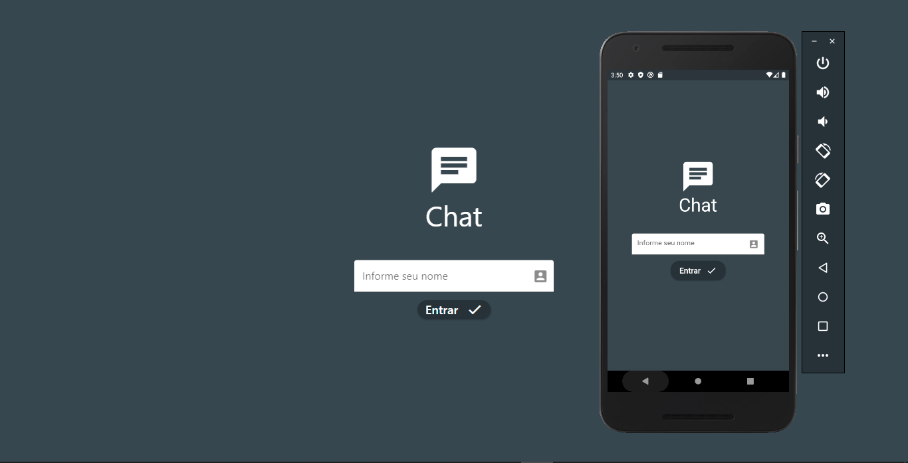
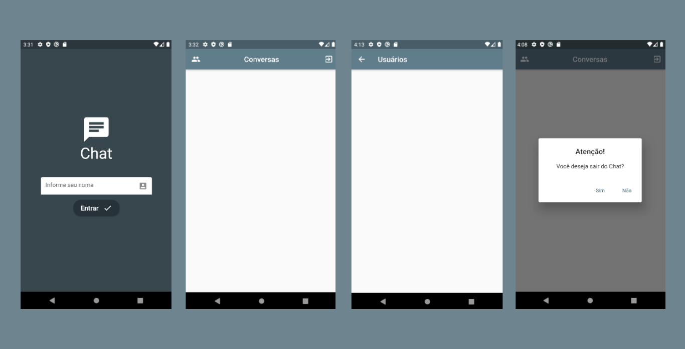

<h1 align="center"> ChatApp </h1>

<h1 align="center"> Descrição do Projeto </h1>

 
Aplicativo de bate papo online em Flutter.

<h1 align="center"> Tela de Login - Web & Android </h1>
<h1 align="center">
  

  <h1 align="center"> Telas do AppChat Android </h1>
  
</h1>
