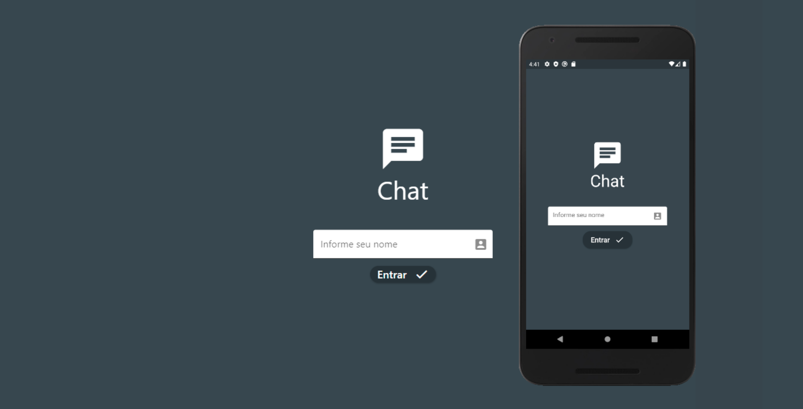
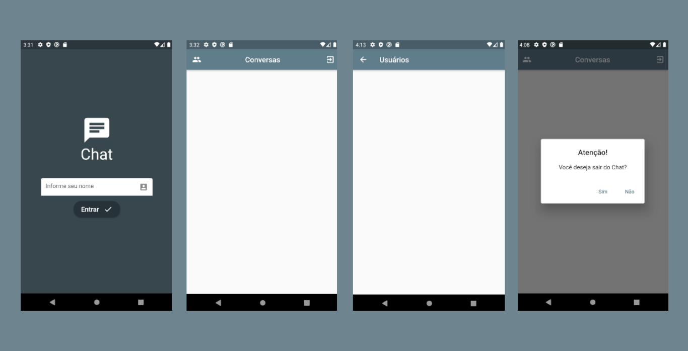

<h1 align="center"> ChatApp </h1>

<h2 align="center"> Descrição do Projeto </h2>

 
Aplicativo de bate papo online em Flutter.

<h2 align="center"> Tela de Login - Web & Android 
</h2>
<h1 align="center">
  

  <h2 align="center"> Telas do AppChat Android </h2>
  
</h1>
